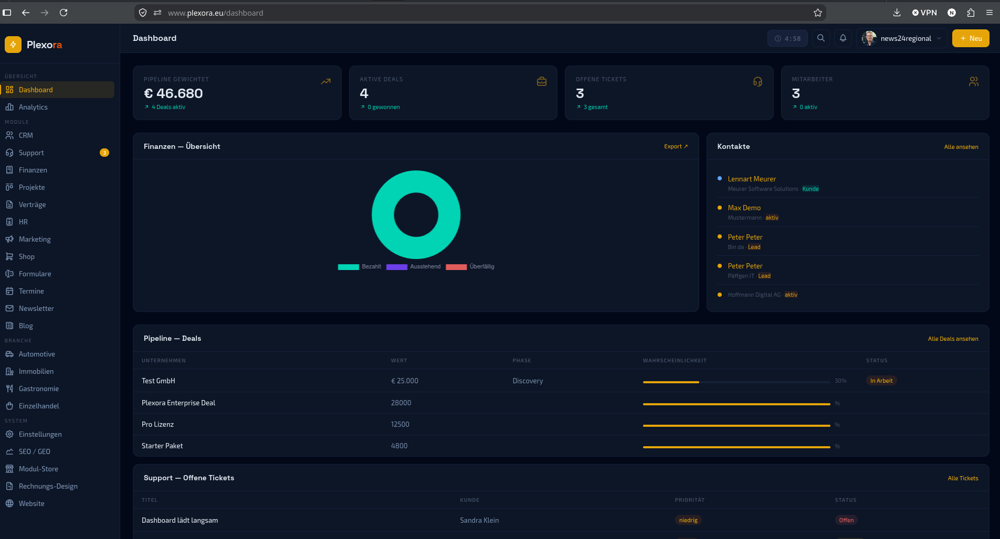
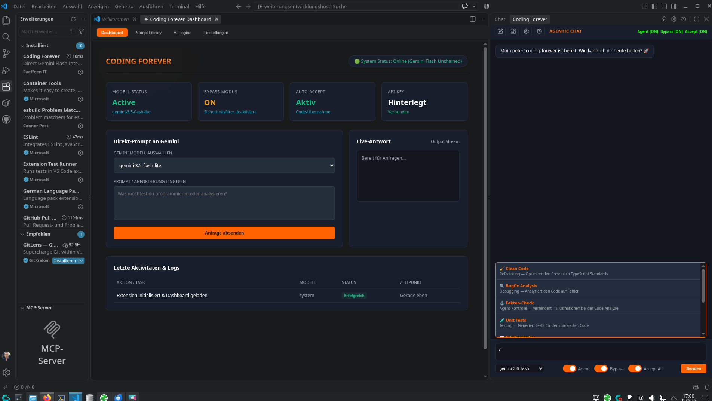

# Hi, ich bin Peter Päffgen 👋

**Senior Full-Stack & Multi-Platform Engineer** — 40+ Jahre IT-Erfahrung, framework-agnostisch und produktorientiert.

Ich entwickle Software, die skaliert — im Web, auf dem Desktop, in der Cloud und auf mobilen Geräten. Ich verbinde moderne Technologien mit tiefem System-Know-how und baue Lösungen, die nicht nur funktionieren, sondern Bestand haben.

📍 Manderscheid, Vulkaneifel · 🌐 [paeffgen-it.de](https://paeffgen-it.de)

---

### 🛠️ Tech-Stack

---

### 🚀 Ausgewählte Projekte

**[Plexora](https://github.com/peter1965p/plexora)** — CRM, Projekte, HR, Finanzen, Support: eine Plattform statt zehn Tools. Multi-Tenant-SaaS, gebaut von einem Entwickler, der selbst weiß, wie es sich anfühlt, zwischen zehn Systemen zu jonglieren.

**[Coding Forever](https://github.com/peter1965p/coding-forever-gemini)** — VS Code Extension mit direkter Gemini-Flash-Integration ohne Limits. Ungedrosselte KI-Entwicklung, genau wie ich sie selbst täglich brauche. Verfügbar im [VS Code Marketplace](https://marketplace.visualstudio.com/items?itemName=PeterPaeffgen.coding-forever).

**[BlutzuckerApp](https://github.com/peter1965p/BlutzuckerApp)** — Cross-Platform Diabetes Tracker mit Avalonia UI, Supabase, OxyPlot und QuestPDF. Offlinefähig, modern, modular.

**[nexora-nuxt](https://github.com/peter1965p/nexora-nuxt)** — Schnelle, individuell steuerbare Website-Engine mit Headless-CMS-Ansatz. Kein Plugin-Wildwuchs, keine Update-Ängste. Live im Einsatz bei paeffgen-it.de.

**[wp-Reloaded](https://github.com/peter1965p/wp-Reloaded)** — Echtes, unverändertes WordPress im Kern, kombiniert mit modernem Headless-Frontend.

---

### 💡 Arbeitsweise

Ich arbeite schnell, strukturiert und eigenverantwortlich. Ich liebe es, komplexe Systeme zu entwirren, moderne Technologien zu kombinieren und Lösungen zu bauen, die sich wie Produkte anfühlen — nicht wie Prototypen.

Kundenspezifische Projekte bleiben aus Diskretionsgründen privat — was du hier siehst, ist die eigene/offene Seite meiner Arbeit.

---

📫 [peter@paeffgen-it.de](mailto:peter@paeffgen-it.de) · 🔗 [LinkedIn](https://www.linkedin.com/in/peter-paeffgen/)
